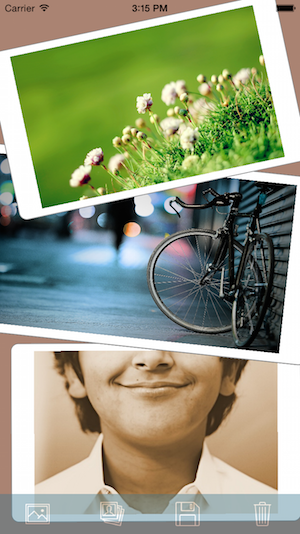

# PhotoMix

PhotoMix allows multiple photos to be placed onto a photo canvas.  
Users can pick photos from the photo album, or snap photos real-time.  
Photos added to the canvas can be resized, rotated and removed on-the-fly to facilitate visual composition.  
The canvas can be saved to the photo album (and shared to social media).

## Screenshots

#### Photo Picker
  
  
#### Main / Delete Photo
  
  

## Credits
* References to Jason Beaver's [TouchImageView](https://github.com/TUIC/TUIC/blob/master/TUIC-2D-iOS/TUIC-2D-iOS/TouchImageView.m) implementation for transform caching
* Icon images sponsored by [Icons8](https://icons8.com/)

## Authors
##### Hsuan-Chih Chuang
